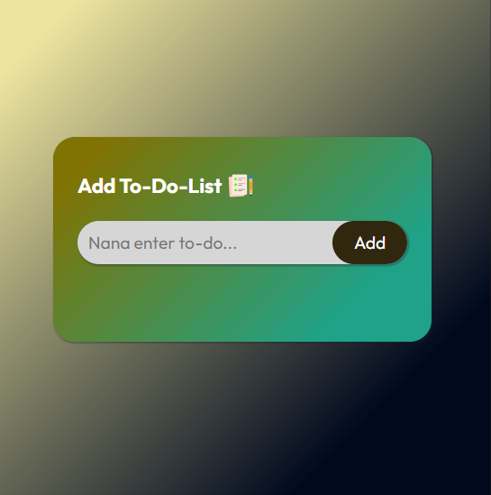

# Rock Paper Scissors 

A simple To-Do App

##
- [Welcome](#welcome)
- [Features](#features)
- [Screenshot](#screenshot)
- [Built with](#built-with)
- [Author](#author)
- [Link](#links)

## Welcome

Thanks for checking out this project.

## Features

- Your list will be saved until you decides to delete.
- You can cross a list when you complete it or even delete it.
- You will be prompted to add a to-do when you click on the add button without adding a list.
  
## Screenshot

## Built With

- Semantic HTML5 markup
- CSS custom properties
- Flexbox
- Mobile-first workflow
- For styles
- JavaScript

## Author

- Gmail at ckid45119@gmail.com

## Links

- live url: [https://francismbroh.github.io/To-Do-App/](https://francismbroh.github.io/To-Do-App/)
